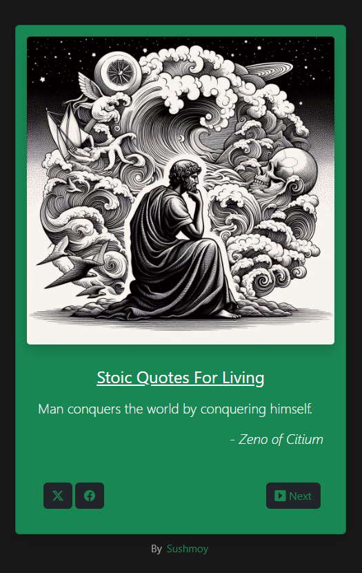

# Stoic-Quotes

Welcome to Stoic-Quotes, a simple yet powerful Quote Machine designed to bring daily doses of wisdom from Stoic philosophers. Whether you're seeking inspiration or guidance, this project provides a seamless experience of discovering timeless Stoic quotes with just a click of a button.

## Table of contents

- [Overview](#overview)
  - [Screenshot](#screenshot)
- [My process](#my-process)
  - [Built with](#built-with)
  - [What I learned](#what-i-learned)
  - [Future Plan](#future-plan)
- [Credits](#credits)
- [Author](#author)

## Overview

### Screenshot

### Built with

- Semantic HTML5 markup
- Tailwind CSS
- Bootstrap
- Vue.js

## Credits

- Stoic quotes sourced from [Orion Philosophy - Stoic Quotes](https://www.orionphilosophy.com/stoic-blog/stoic-quotes)

### What I learned

Enhanced my knowledge about the Tailwind CSS, Bootstrap, and Vue.js.

### Future Plan
1. Add a drop-down feature to let user explore quotes of only the chosen author of their choice
2. Replace the colors